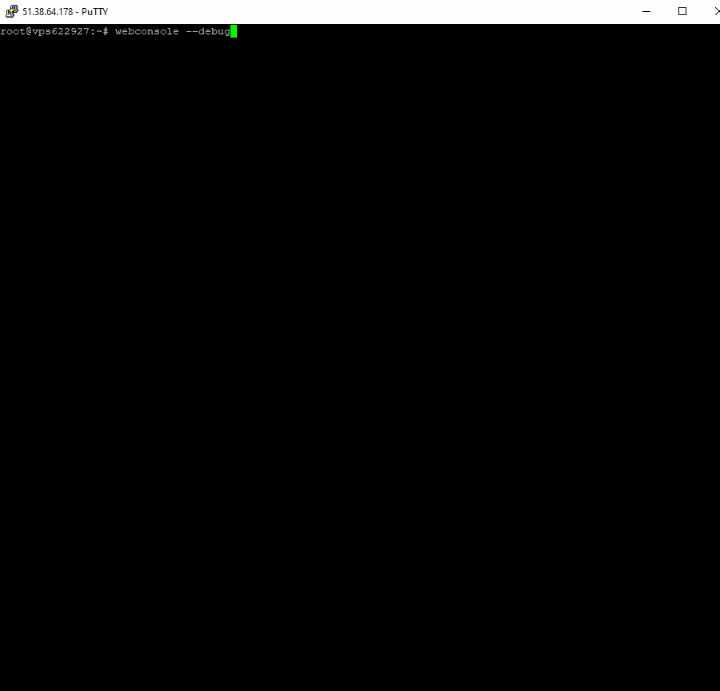

# Web Console
Provides a simple web interface for command-line applications - quickly publish a Python / Bash / Powershell / Batch / etc script as a basic web app. Turns STDOUT into formatted text, alerts and progress indicators.

Cross-platform, runs as a self-contained web server, binaries are available for Windows and Linux (including Raspberry Pi). The install process includes setup as a service on each platform.

Web Console is intended to be used behind a proxy server or tunneling service, it doesn't by itself handle HTTPS connections. Web Console has been used behind [Apache](https://httpd.apache.org/) and [NGINX](https://www.nginx.com/) acting as reverse-proxy servers, we recommend [Caddy](https://caddyserver.com/) for its ease-of-use in automatically dealing with HTTPS provision for you. Web Console includes built-in support for tunnling-with-authentication services from [Cloudflare](https://www.cloudflare.com/en-gb/lp/ppc/zero-trust-network-access-x/) and [ngrok](https://ngrok.com/).

Web Console's implementation prioritises ease of configuration and use - it's easy to manipulate configurations and user data to provide the functionality you want.

As well as providing a user interface, Web Console also provides a simple REST API, providing URLs for services such as [IFTTT](https://ifttt.com/) and [Zapier](https://zapier.com/) or letting you trigger tasks from remote systems (including [GitHub Actions](https://github.com/features/actions)) with command-line tools like [wget](https://www.gnu.org/software/wget/) and [curl](https://curl.se/).

If the above explanation of what Web Console is doesn't match up with what you are trying to do, try the [Alternatives](docs/ALTERNATIVES.md) page for links to applications that might be more suitable.

## Live Demo

You can use a working [live demo](https://webconsole.sansay.co.uk/view?taskID=4jaknvvu0b4zl3ee) right now, or simply watch this quick (30-second) video:



The above link runs a simple [demo application](https://github.com/dhicks6345789/web-console/blob/master/examples/test.py) that produces some example output, showing the different types of output message supported. It also prints a progress percentage, which is displayed by Web Console as a progress bar.

## Installation

Installation instructions for all platforms, including details of building from source, can be found on the [installation](docs/INSTALLATION.md) page.

## Usage

Web Console runs "tasks", individual scripts / applications that each have their own URL where execution can be triggered and output can be seen. Pretty much any existing application runable from the command line should work, returning any console output sent to STDOUT or STDERR to the web-based user interface.

If you are writing a new script or command line utility (or reformatting the output from an existing utility) you can produce output specifically for Web Console to interpret and display in certain ways. For more details, see the [Tasks](docs/TASKS.md) documentation page.

The Webconsole binary is also used as a command-line tool for configuration. At the command line, type `webconsole --help` for a [command summary](https://www.sansay.co.uk/docs/web-console/COMMANDS.txt).

### Startup

If you install Web Console using the install script then it should run as a service, starting when your machine boots. If you just run the binary, without any other arguments, it will start and listen (by default) on port 8090 for HTTP connections. If you start with the "debug" argument, i.e.:

```
webconsole --debug
```

Then Web Console will start in debug mode, printing information to the console about each received HTTP request.

### Main Configuration

On startup, Web Console attempts to locate a configuration file. This can be in CSV or Excel format, named "config.csv" or "config.xlsx". It will first look in `/etc/webconsole` on MacOS / Linux, or in `C:\Program Files\webconsole` on Windows, followed by the current folder.

The configuration file has a simple `Parameter, Value` format. Valid parameters are:
* pathPrefix: For use when Web Console is used behind a proxy server and isn't at the root of the domain name, tells the web server what path prefix it has been given. E.g.: `/webconsole`.

### Task Configuration

Webconsole will look in the defined "tasks" folder (by default, on Linux / MacOS, `/etc/webconsole/tasks`, on Windows, `C:\Program Files\webconsole\tasks`) for subfolders. Any subfolders found will be searched for a "config.txt" file and used as a Task ID if found. Task IDs generated by the Webconsole application are random 16-character strings, but any string (no spaces) can be used.

The format of config.txt is a basic YAML-style text - keywords followed by a colon then the given value, e.g.:

```
title: Test Site
public: N
command: /root/buildSite.sh
```
Valid keywords are:
* title: The title of the Task, displayed in the header on the Task page and as the page title.
* description: Descriptive text saying what the task does.
* secret: A secret phrase / key / password. If present, must be given during the authentication process - can be passed in via GET (not very secure) or POST.
* public: If "Y", this Task will be listed on the index page. Obviously, only use for Tasks you want to be made public.
* ratelimit: If more than 0, then this Task will not be allowed to run more often than the given number of seconds.
* progress: If "Y", then a progress bar will be presented on the page. The percentages the progress bar shows will be guessed from previous runtimes of this Task.
* command: The command line to run. Pretty much any valid command line (or shell / batch script) should work.

Note that changes to config.txt for any Task will be in effect the next time the Task is triggered, without any need to restart / reload anything server side or even refresh the web interface if you already have the Task's page open.

More details can be found on the [documentation page](docs/TASKS.md).

## Dependancies

This project contains binaries from:

* [The Non-Sucking Service Manager](https://nssm.cc/) by Iain Patterson, used to set up services on Windows. Public Domain license.

The web user interface is constructed using [Bootstrap 5](https://getbootstrap.com/docs/5.0/getting-started/introduction/) with [Popper](https://popper.js.org/). All required library files are included in the project and release distributions so Web Console can run as a self-contained application on a non-networked workstation / kiosk device if needed.

In-browser Markdown rendering (for the "description" section of each Task page) is handled by the [Marked](https://marked.js.org/) Javascript library.

The text editor in the "Edit" section of the user interface is implemented using [Ace](https://ace.c9.io/). Ace isn't embedded in the project in the same way Bootstrap is (the Ace project consists of a large number of separate JS files, and I couldn't figure out Git's sub-project feature...), it's simply copied into the www/ace folder at build time - check the build scripts (build.sh/build.bat) for details.

Code for the resizeable file browser / code editor panel originated from [Nguyen Huu Phuoc](https://htmldom.dev/create-resizable-split-views/).

Code for the file browser tree view originated from [W3Schools](https://www.w3schools.com/howto/howto_js_treeview.asp).

## To Do

See the dedicated [To-Do list](docs/TODO.md) in the documentation.
